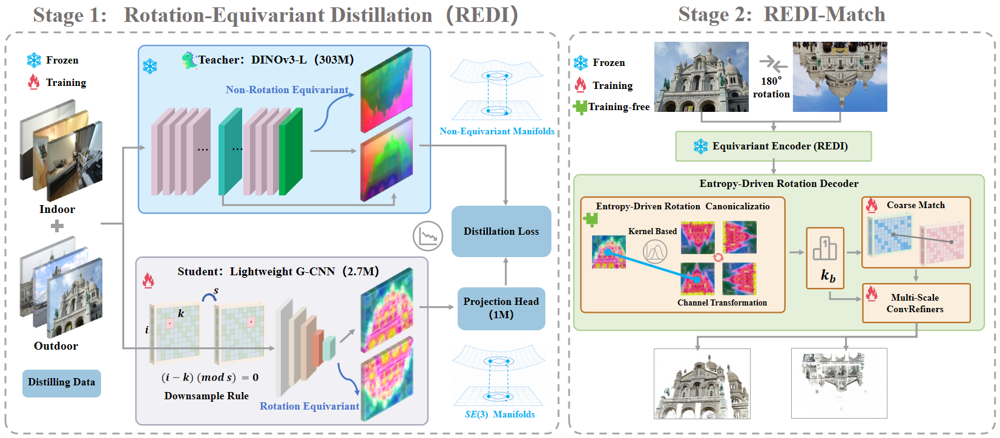
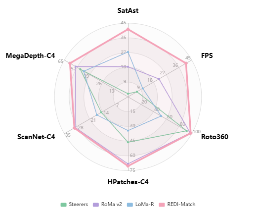
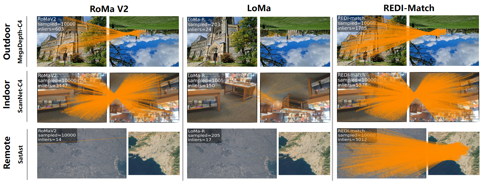
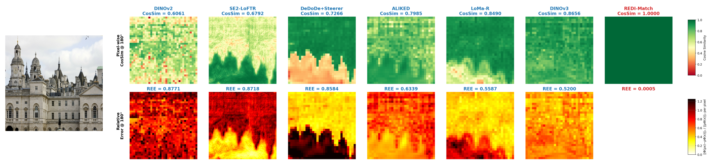
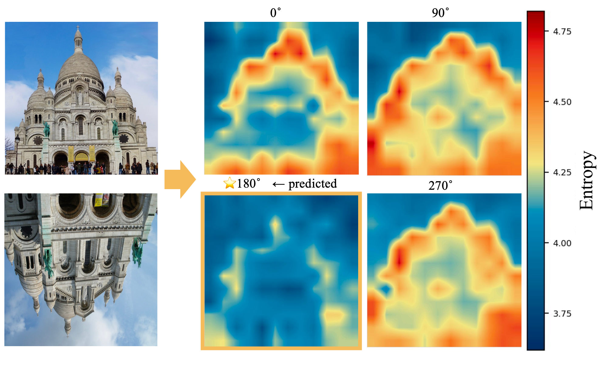

# REDI-Match

### Rotation-Equivariant Distillation for Efficient and Robust Dense Matching

**Yinji Ge**<sup>1*</sup>, **Guixu Zheng**<sup>2*</sup>, **Wulong Guo**<sup>3</sup>, **Qian Feng**<sup>4</sup>, **Xu Wu**<sup>1</sup>, **Kai Zhou**<sup>1†</sup>, **Xinyuan Liu**<sup>1†</sup>, **Fei Xing**<sup>1†</sup>

<sup>1</sup> Tsinghua University &nbsp; <sup>2</sup> Southern University of Science and Technology &nbsp; <sup>3</sup> Beihang University &nbsp; <sup>4</sup> Zhejiang University

<small><sup>*</sup> Equal contribution &nbsp; <sup>†</sup> Corresponding authors</small>

[](https://arxiv.org/abs/2606.24330)
[](https://arxiv.org/pdf/2606.24330)

## 📄 Abstract

Vision Foundation Models (VFMs) have significantly advanced dense feature matching, yet severe in-plane rotation remains a critical challenge. Existing solutions face a fundamental dilemma: data-driven methods require inefficient parameter scaling to implicitly learn rotations, whereas strictly equivariant networks lack the semantic capacity of modern VFMs. To break this architectural bottleneck, we propose **REDI-Match**, an efficient framework driven by a novel **Rotation-Equivariant Distillation (REDI)** paradigm. Instead of relying on massive data augmentation, REDI distills the powerful semantics of a VFM into a lightweight, strictly rotation-equivariant encoder, structurally capturing geometric variations early at the feature level. To fully exploit these features, we equip the decoder with an entropy-driven spatial alignment module that explicitly locks onto the canonical coordinate system, eliminating global ambiguity before continuous refinement.

## 🎯 Key Highlights

| | |
|---|---|
| 🏆 **+13.89%** AUC@5° on SatAst | Outperforms SOTA under extreme rotations |
| ⚡ **1.9× faster** than RoMa v2 | Real-time **~41 FPS** on RTX 4090 |
| 🧱 **85M** parameters | 5× fewer than RoMa v2 (425M) |
| 🎓 **112× compression** | Distills 303M VFM → 2.7M equivariant encoder |
| 🔄 **Strict C₄-equivariant** | Mathematically guaranteed rotation consistency |

## 🏗️ Pipeline Overview



**Left (Stage 1):** A frozen VFM (DINOv3-L) is distilled into a lightweight G-CNN via MSE loss, projecting non-equivariant semantics onto a strictly rotation-equivariant manifold.  
**Right (Stage 2):** The entropy-driven rotation decoder evaluates discrete hypotheses to lock onto the canonical orientation, enabling robust dense matching without rotation-augmented training data.

## 📊 Results

### Radar Comparison



REDI-Match achieves the best overall accuracy–efficiency trade-off across all benchmarks.

### Rotation Benchmarks (MegaDepth-C4 / ScanNet-C4 / HPatches-C4 / Rot360 / SatAst)

All methods evaluated at 576×576. **Bold**: best, <u>Underline</u>: second best. OOD = out-of-distribution failure.

| Method | MegaDepth-C4 | | | ScanNet-C4 | | | HPatches-C4 | | | Rot360 | | | SatAst | | |
|---|---|---|---|---|---|---|---|---|---|---|---|---|---|---|---|
| | @5° | @10° | @20° | @5° | @10° | @20° | @3° | @5° | @10° | @3° | @5° | @10° | @5° | @10° | @20° |
| **Sparse** | | | | | | | | | | | | | | | |
| ALIKED+VGGT | 18.4 | 32.6 | 47.0 | 10.6 | 23.7 | 38.9 | 13.6 | 23.2 | 38.0 | 52.7 | 75.6 | 94.4 | 14.3 | 19.6 | 22.7 |
| Steerers | 48.7 | 65.9 | 78.9 | 14.7 | 29.6 | 44.5 | 46.2 | 63.4 | 79.0 | 89.9 | 92.1 | 94.4 | 1.9 | 2.9 | 3.7 |
| LoMa-R | 45.2 | 62.6 | 76.6 | 17.1 | 31.9 | 45.4 | 34.3 | 49.8 | 65.5 | 45.2 | 52.0 | 61.2 | <u>27.4</u> | <u>42.0</u> | <u>51.7</u> |
| **Dense** | | | | | | | | | | | | | | | |
| DKM | 16.2 | 20.6 | 23.8 | 12.9 | 24.5 | 35.7 | 23.3 | 28.9 | 34.8 | 48.4 | 50.2 | 52.0 | 9.9 | 12.1 | 13.6 |
| RoMa | 25.9 | 37.7 | 48.5 | 12.6 | 23.9 | 35.6 | 28.8 | 41.2 | 54.3 | 50.4 | 58.4 | 67.3 | 14.1 | 19.0 | 22.1 |
| RoMa v2 | <u>53.5</u> | <u>68.9</u> | <u>80.1</u> | <u>29.0</u> | <u>49.5</u> | <u>65.9</u> | <u>68.2</u> | <u>78.1</u> | <u>87.0</u> | <u>97.3</u> | <u>97.7</u> | <u>98.0</u> | 18.4 | 24.2 | 28.5 |
| **REDI-Match** | **59.2** | **74.3** | **84.8** | **29.5** | **50.6** | **68.0** | **70.4** | **79.6** | **87.7** | **98.5** | **98.6** | **98.6** | **41.3** | **50.6** | **57.4** |

### Standard Benchmarks (MegaDepth / ScanNet / HPatches) + Efficiency

All methods at 576×576, latency on single RTX 4090.

| Method | MegaDepth | | | ScanNet | | | HPatches | | | Params | Latency |
|---|---|---|---|---|---|---|---|---|---|---|---|
| | @5° | @10° | @20° | @5° | @10° | @20° | @3° | @5° | @10° | (M) | (ms) |
| **Sparse** | | | | | | | | | | | |
| ALIKED+LG | 37.3 | 55.3 | 70.9 | 16.7 | 33.3 | 50.0 | 60.4 | 73.1 | 84.4 | 12.6 | 27.3 |
| Steerers | 50.6 | 67.4 | 80.2 | 14.9 | 29.6 | 44.6 | 67.7 | 77.5 | 86.8 | 33.4 | 159.4 |
| LoMa-R | 50.1 | 66.8 | 79.8 | 25.9 | 47.7 | 66.6 | 61.1 | 73.8 | 85.4 | 341.5 | 91.9 |
| **Semi-Dense** | | | | | | | | | | | |
| EfficientLoFTR | 48.5 | 65.4 | 78.3 | 18.7 | 36.6 | 53.6 | 68.3 | 77.6 | 86.2 | 15.1 | **18.2** |
| **Dense** | | | | | | | | | | | |
| DKM | 58.1 | 73.3 | 84.1 | 29.2 | 50.4 | 68.0 | <u>71.3</u> | <u>80.4</u> | 88.4 | 72.3 | 34.3 |
| RoMa | 59.6 | 74.4 | 84.9 | <u>31.0</u> | <u>52.6</u> | <u>70.2</u> | 70.4 | 79.9 | 88.2 | 415.7 | 78.4 |
| RoMa v2 | **60.0** | **74.8** | **85.2** | **33.3** | **56.0** | **73.4** | 70.7 | 80.4 | <u>89.0</u> | 425.4 | 45.7 |
| **REDI-Match** | <u>59.8</u> | <u>74.7</u> | <u>84.9</u> | 30.2 | 51.4 | 68.8 | **72.1** | **81.2** | **89.1** | **94.9** | <u>24.1</u> |

### Qualitative Comparison under Severe Rotations



Across outdoor (MegaDepth-C4), indoor (ScanNet-C4), and remote sensing (SatAst) — REDI-Match consistently maintains dense, accurate alignments while SOTA methods suffer catastrophic failure on SatAst.

## ⚖️ Equivariance Analysis



Our distilled equivariant encoder preserves strict spatial and semantic consistency under rotation, achieving near-zero feature degradation. In contrast, standard non-equivariant foundation models exhibit severe structural collapse.

## 🔬 Entropy-Driven Rotation Detection



Correct matching is consistently accompanied by low-entropy distributions across orientation hypotheses. The entropy-driven module identifies the optimal canonical orientation without any training.

## 📦 Code & Models

> 🚧 **Coming Soon** — Code, pretrained weights, and inference demo will be released upon publication. Stay tuned!

## 📝 Citation

```bibtex
@article{ge2025redimatch,
  title   = {REDI-Match: Rotation-Equivariant Distillation for Efficient and Robust Dense Matching},
  author  = {Ge, Yinji and Zheng, Guixu and Guo, Wulong and Feng, Qian and Wu, Xu and Zhou, Kai and Liu, Xinyuan and Xing, Fei},
  journal = {arXiv preprint arXiv:2606.24330},
  year    = {2026}
}
```
