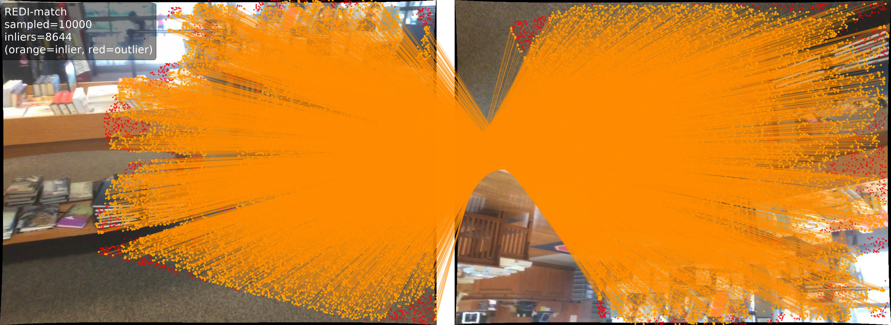
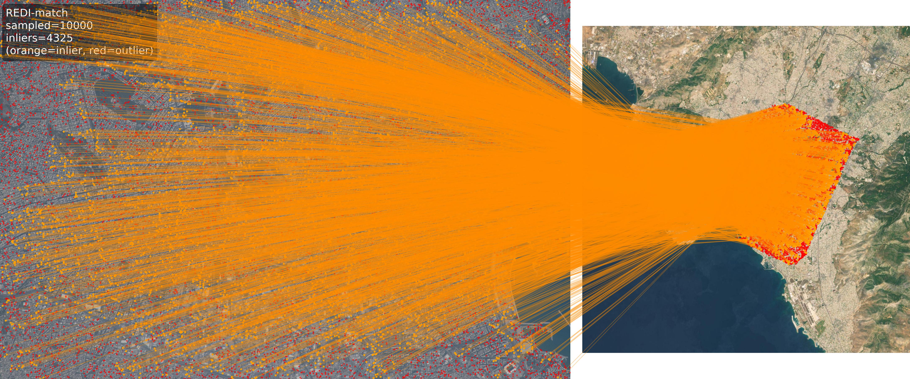
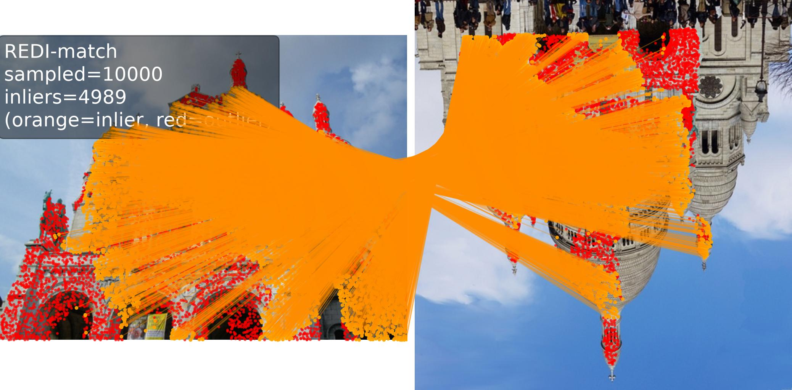
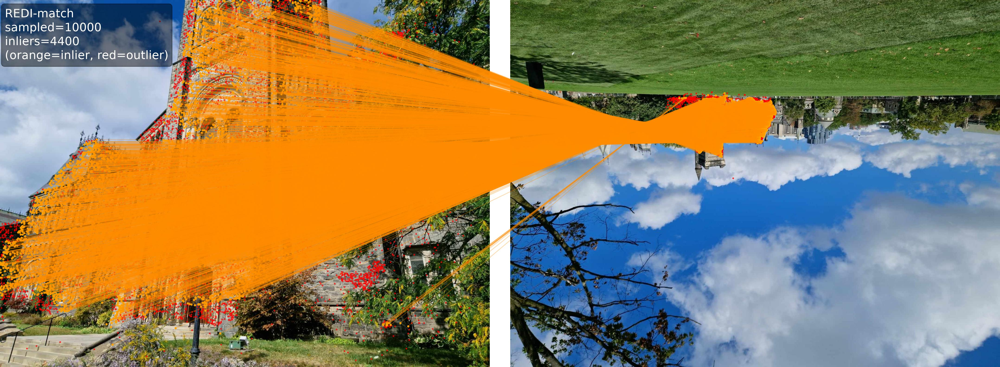

# REDI-Match

### 🎓 Rotation-Equivariant Distillation for Efficient and Robust Dense Matching

<div align="center">

**Yinji Ge**<sup>1*</sup>, **Guixu Zheng**<sup>2*</sup>, **Wulong Guo**<sup>3</sup>, **Qian Feng**<sup>4</sup>, **Xu Wu**<sup>1</sup>, **Kai Zhou**<sup>1†</sup>, **Xinyuan Liu**<sup>1†</sup>, **Fei Xing**<sup>1†</sup>

<sup>1</sup> Tsinghua University &nbsp; <sup>2</sup> Southern University of Science and Technology &nbsp; <sup>3</sup> Beihang University &nbsp; <sup>4</sup> Zhejiang University

<small><sup>*</sup> Equal contribution &nbsp; <sup>†</sup> Corresponding authors</small>

[](https://arxiv.org/abs/2606.24330)
[](https://arxiv.org/pdf/2606.24330)
[](https://huggingface.co/YinjiGe/REDI-Match)
[](https://github.com/YinjiGe/REDI-Match-0823)

</div>

This repository is the runnable public release of REDI-Match for dense matching inference, visualization, and benchmark evaluation. It contains the inference runtime, pretrained-weight download tools, evaluation scripts, and example data. Training, distillation, private data processing, and internal experiments are excluded.

## 📑 Contents

- [📄 Abstract](#-abstract)
- [🎯 Highlights](#-highlights)
- [🖼 Visual results](#-visual-results)
- [⚙ Installation](#-installation)
- [📦 Pretrained weights](#-pretrained-weights)
- [🎨 Demo](#-demo)
- [📊 Evaluation](#-evaluation)
- [📈 Benchmark results](#-benchmark-results)
- [⏱ Latency](#-latency)
- [🧩 Release scope](#-release-scope)
- [✅ TODO](#-todo)
- [📝 Citation](#-citation)
- [🙏 Acknowledgments](#-acknowledgments)

## 📄 Abstract

Vision foundation models have advanced dense feature matching, but severe in-plane rotation remains challenging. REDI-Match addresses this problem with **Rotation-Equivariant Distillation (REDI)**: the semantics of a vision foundation model are distilled into a lightweight, strictly rotation-equivariant encoder. An entropy-driven decoder then identifies the canonical orientation before continuous refinement, enabling robust dense matching without rotation-augmented training.

## 🎯 Highlights

| | |
|---|---|
| ⚡ **Rotation robustness** | +13.89% AUC@5° on SatAst over the previous best method |
| 🚀 **Efficiency** | 1.9× faster than RoMa v2; about 41 FPS on an RTX 4090 |
| 🧩 **Compact model** | 85M parameters, compared with 425M for RoMa v2 |
| 🔄 **Equivariance** | Strict C₄ rotation-equivariant feature encoder |

## 🖼 Visual results

The public demo produces dense correspondences for indoor, remote-sensing, and rotated outdoor image pairs:

<p align="center">
  
  
</p>
<p align="center">
  
  
</p>

All generated visualizations are available in [`results/`](results/).

## 🗂 Repository layout

```text
demo/                         # Matching visualization demo
eval/                         # MegaDepth, ScanNet, HPatches, and other benchmarks
redimatch/                    # Public inference runtime
assets/                       # Demo input images
results/                      # Generated demo results
data/README.md                # External evaluation data layout
scripts/download_weights.py   # Download weights from Hugging Face
scripts/check_release.py      # Check release boundaries and weight compatibility
models/                       # Local weight directory (*.pth is not tracked by Git)
```

## ⚙ Installation

Python 3.12 and a CUDA environment are recommended:

```bash
conda create -n redimatch python=3.12 -y
conda activate redimatch
pip install -r requirements.txt
```

The release uses native PyTorch operators by default. It does not require `escnn`, a Fortran compiler, DINOv3, or training dependencies.
For optional CUDA extensions, first confirm compatibility with your local PyTorch and CUDA versions:

```bash
pip install -r requirements-optional.txt
```

## 📦 Pretrained weights

`indoor.pth` and `outdoor.pth` are large files and should not be committed to GitHub. Download them from the Hugging Face model repository; the code repository keeps only `models/.gitkeep`.
The pretrained weights are hosted at [`YinjiGe/REDI-Match`](https://huggingface.co/YinjiGe/REDI-Match):

| Weight | Recommended use |
|---|---|
| `indoor.pth` | Indoor scenes such as ScanNet |
| `outdoor.pth` | Outdoor, aerial, and remote-sensing scenes |

```bash
pip install huggingface_hub
python scripts/download_weights.py \
  --repo-id YinjiGe/REDI-Match \
  --output-dir models
```

You can also download the files manually and place them at:

```text
models/indoor.pth
models/outdoor.pth
```

For a private model repository, run `huggingface-cli login` first or pass an access token with `--token`.

## 🎨 Demo

Run the default example. It uses the `remote_satast` image pair and the outdoor weights:

```bash
python demo/demo_match.py
```

Results are saved to `results/demo_match_symmetric.jpg` and `results/demo_match_warp.jpg`.
You can specify any image pair, weight file, and output path. The default is 10,000 sampled matches:

```bash
python demo/demo_match.py \
  --im_A assets/indoor_scannet_A.jpg \
  --im_B assets/indoor_scannet_B.jpg \
  --weights models/indoor.pth \
  --save_sym results/indoor_symmetric.jpg \
  --save_warp results/indoor_warp.jpg
```

The repository includes four example pairs:

```text
assets/indoor_scannet_A.jpg     assets/indoor_scannet_B.jpg
assets/remote_satast_A.jpg      assets/remote_satast_B.jpg
assets/sacre_coeur_A.jpg        assets/sacre_coeur_B_rot180.jpg
assets/toronto_A.jpg            assets/toronto_B_rot180.jpg
```

The corresponding visualizations are in `results/`. Use `models/indoor.pth` for indoor images and `models/outdoor.pth` for the other examples.

## 📊 Evaluation

### 🗃 Data

Full benchmark datasets are not included because of their size and licensing terms. Follow [data/README.md](data/README.md) to download or mount them under `data/`, or provide external paths through command-line arguments.

Typical directory layout:

```text
data/megadepth/
data/megadepth_rot/
data/scannet/scans/
data/scannet/scans_rot/
data/hpatches/
data/roto360/
data/satast/
data/WxBS/
```

### ▶ Commands

All evaluation scripts read weights from `models/` and data from `data/` by default. Missing data paths are reported at startup.

```bash
# MegaDepth plain / rot
python eval/eval_megadepth.py --mode plain
python eval/eval_megadepth.py --mode rot

# ScanNet plain / rot
python eval/eval_scannet.py --mode plain
python eval/eval_scannet.py --mode rot

# HPatches plain / rot
python eval/eval_hpatches.py --mode plain
python eval/eval_hpatches.py --mode rot

# Other benchmarks
python eval/eval_roto360.py
python eval/eval_satast.py
python eval/eval_wxbs.py

# Examples with external data roots
python eval/eval_hpatches.py --hpatches_root /path/to/hpatches
python eval/eval_satast.py \
  --satast_annotations /path/to/satast/satast_annotations_with_rot \
  --satast_image_root /path/to/satast
python eval/eval_wxbs.py --wxbs_root /path/to/WxBS
```

Evaluation outputs are written to `results/`. CUDA evaluation scripts usually require an NVIDIA GPU. Run `--help` for the full options of each script.

## 📈 Benchmark results

The following results are reported in the paper. Unless noted otherwise, images are evaluated at 576×576 resolution and the metric is AUC.

### 🔄 Rotation robustness

| Method | MegaDepth-C4 @5° | ScanNet-C4 @5° | HPatches-C4 @5° | Rot360 @5° | SatAst @5° |
|---|---:|---:|---:|---:|---:|
| RoMa v2 | 53.5 | 29.0 | 78.1 | 97.7 | 24.2 |
| **REDI-Match** | **59.2** | **29.5** | **79.6** | **98.6** | **41.3** |

### ⚡ Standard benchmarks and efficiency

| Method | MegaDepth @5° | ScanNet @5° | HPatches @3° | Params (M) | Latency (ms) |
|---|---:|---:|---:|---:|---:|
| RoMa v2 | **60.0** | **33.3** | 70.7 | 425.4 | 45.7 |
| **REDI-Match** | 59.8 | 30.2 | **72.1** | **85.4** | **24.1** |

Latency is measured on a single NVIDIA RTX 4090. See the paper for complete comparisons, protocols, and ablations.

<details>
<summary>Full rotation benchmark table</summary>

| Method | MegaDepth-C4 @5° | @10° | @20° | ScanNet-C4 @5° | @10° | @20° | HPatches-C4 @3° | @5° | @10° | Rot360 @3° | @5° | @10° | SatAst @5° | @10° | @20° |
|---|---:|---:|---:|---:|---:|---:|---:|---:|---:|---:|---:|---:|---:|---:|---:|
| RoMa v2 | 53.5 | 68.9 | 80.1 | 29.0 | 49.5 | 65.9 | 68.2 | 78.1 | 87.0 | 97.3 | 97.7 | 98.0 | 18.4 | 24.2 | 28.5 |
| **REDI-Match** | **59.2** | **74.3** | **84.8** | **29.5** | **50.6** | **68.0** | **70.4** | **79.6** | **87.7** | **98.5** | **98.6** | **98.6** | **41.3** | **50.6** | **57.4** |

</details>

## ⏱ Latency

```bash
python eval/bench_latency.py \
  --weights models/outdoor.pth \
  --resolution 576
```

## 🧩 Release scope

This public repository contains inference-only code and does not include:

- REDI distillation or training scripts;
- model training, EMA, experiment monitoring, or private data preparation code;
- `escnn_lib`, DINOv3 teacher weights, or other training-only dependencies.

## ✅ TODO

- [x] Release benchmark evaluation scripts
- [x] Release pretrained model weights
- [x] Release inference visualization scripts
- [x] Release evaluation dataset access instructions
- [ ] Release REDI training code
- [ ] Release model training code
- [ ] Release model training datasets

## 📜 License

The REDI-Match source code is released under the [Apache License 2.0](LICENSE).

Pretrained weights, example images, and evaluation datasets may be subject to
their own licenses and distribution terms. Third-party source files retain
their original copyright notices and license requirements. Check the
corresponding notices before redistribution.

## 📝 Citation

<div align="center">

### ⭐ If you find REDI-Match useful, please star this repository!

Your support helps us improve and maintain the project.

</div>

If you find this work useful, please cite our paper:

```bibtex
@article{ge2026redimatch,
  title   = {REDI-Match: Rotation-Equivariant Distillation for Efficient and Robust Dense Matching},
  author  = {Ge, Yinji and Zheng, Guixu and Guo, Wulong and Feng, Qian and Wu, Xu and Zhou, Kai and Liu, Xinyuan and Xing, Fei},
  journal = {arXiv preprint arXiv:2606.24330},
  year    = {2026}
}
```

Paper: [arXiv:2606.24330](https://arxiv.org/abs/2606.24330)

## 🙏 Acknowledgments

We gratefully thank the authors and maintainers of the following open-source projects that inspired and supported this work:

- [**RoMa**](https://github.com/Parskatt/RoMa) — Robust dense feature matching
- [**DINOv3**](https://github.com/facebookresearch/dinov3) — Self-supervised visual representation learning
- [**e2cnn**](https://github.com/QUVA-Lab/e2cnn) — Equivariant steerable CNNs
